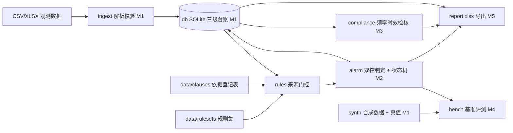

# pit-monitoring-checker

建筑基坑工程监测数据判读与预警工具：**全离线、规则优先、判定挂条款号、内置可复现基准**。
它管的是一座基坑从开挖到封底的全部量测读数 —— 台账持久、阈值来源可溯、"报警未处置"能一路跟着下一个轮次。

> **当前状态：M6 脱敏门已固化，发布动作待用户授权**（契约级骨架 M0 + 合成时序与真值 M1 + 双控判定内核与 XLSX 输入 M2 +
> 合规检核 M3 + 基准评测 M4 + xlsx 报告与桌面界面与 onedir exe M5 + 脱敏审计器与发布台账 M6）。
> 建仓 / push / tag / release 属对外动作，未授权不执行（进度与偏差台账见 `plan/RELEASE-M6.md`，里程碑见[路线图](#路线图)）。
> 现在可运行的部分是：契约自检、台账建库与建档、监测项目字典与规则集来源门控、合成数据生成与位级对账、
> 一轮观测数据的导入回执、台账修订链与缺测查询、双控报警判定与未闭环延续、监测频率与时效合规检核、
> 内置基准评测（逐起事件对账 + 四态指标表 + `--markdown` 指标节）、
> 日报/周报/阶段报告导出（标准库直写 xlsx + 原生过程线图 + 追溯清单）、五页签桌面界面与冻结 exe 通路、
> 入库面/历史/提交信息的脱敏审计。

## 现在能做什么

| 命令 | 作用 | 状态 |
|---|---|---|
| `python -m pmc selfcheck` | 契约自检：依据登记表 / 监测项目字典 / 规则集来源门控 / 台账 DDL / 确定性 RNG | 可用 |
| `python -m pmc init --db ledger.sqlite` | 建 11 张表的空台账（工程→工况→测点→轮次→观测修订链→报警状态→处置→违规） | 可用 |
| `python -m pmc dict` | 列出监测项目字典与各自的来源登记状态 | 可用 |
| `python -m pmc rulesets` | 列出规则集版本、sha256 与启用门控统计（卡在哪个原因码） | 可用 |
| `python -m pmc synth --seed 20260107 --sites 3 --force [--db …]` | 生成三座虚拟基坑的合成时序与 7 类事件真值（字节冻结）；带 `--db` 时另建工程/工况/测点/轮次档案 | 可用 |
| `python -m pmc synth --check` | 与仓内 62 个产物逐字节对账，改生成器却忘重生成当场暴露 | 可用 |
| `python -m pmc import FILE --project SYN-ZHDQ --round 12 --db … [--dry-run]` | 导入一轮观测数据并出具导入回执（逐行拒收带原因码与物理行号） | 可用 |
| `python -m pmc ledger --db … --point SYN-TH-18` | 台账查询：修订链（谁取代谁）、缺测标记、加密观测轮次 | 可用 |
| `python -m pmc check --db ledger.sqlite --project SYN-ZHDQ [--round N] [--rules-dir DIR]` | 双控判定：有效阈值选取（档案值优先→条文回退→待定）、状态机、未闭环清单，结果落 `alarm_state` | 可用 |
| `pmc audit --db … [--project CODE] [--from N --to N] [--rules-dir DIR]` | 频率与时效检核：漏测 / 超间隔 / 工况变更后仍按旧频率 / 报警后未加密观测，逐条挂规则号 + 条款号 + 可复算证据 | 可用 |
| `pmc bench [--plane synth/ledger] [--all / --sites CODE,...] [--json] [--markdown]` | 内置基准评测：逐起事件对账 + 四态指标 + 漏报清单；与 `data/golden/` 位级对账 | 可用 |
| `pmc report --kind daily/weekly/stage --db … --project … [--round N] [--from/--to] [--bench-plane synth]` | 导出 xlsx 报告：标准库直写 OOXML（零第三方依赖）、异常清单 / 报警台账 / 未闭环 / 合规检核 / 原生过程线图 / 追溯清单 / 签字栏；两次导出逐字节一致 | 可用 |
| `pmc gui --db … [--smoke]` | PySide6 五页签桌面界面（台账 / 导入 / 判定 / 检核 / 报告），只消费同一条 CLI 命令链 | 可用（需 `.[gui]`） |
| `python scripts/desensitize_audit.py [--mode tracked/history/messages] [--selftest]` | 脱敏审计：入库面 / 全历史 blob / 提交信息三段扫描 + `--include` 扫生成物（xlsx 逐 zip 条目）；`--selftest` 用片段拼接的伪造样本反证扫描器不空转；输出只给「位置 [类别] x次数」，不回显命中原文 | 可用 |
| `python scripts/dist_audit.py [--selftest] [--report a.xlsx]` | 构建产物红线审计：内嵌数据逐份 sha256 对账 + 禁区成分 + 个人标记诱饵 + 报告 0 外链；`--selftest` 用伪造产物反证审计器 | 可用 |
| `pyinstaller packaging/pmc.spec` | onedir 双 exe：`pmc.exe`（控制台，脚本化验证通路）+ `pmc-gui.exe`（界面），`data/` 走白名单内嵌 | 可用（需 `.[pkg]`） |

退出码语义（M0 定稿，之后不漂移）：`0` 完成 / `1` 完成但有降级（存在未闭环报警、未核对依据、被拒收行、应核实事项或报告含待定值）/ `2` 输入不可用或契约校验失败 / `3` 命令所属里程碑未到（M5 起全部命令已落地，`3` 只作兜底）。

## 指标

基准已经跑过了，但这一节只放**台账面**（）的结论：生产数据面一条阈值都没核对，四项基准指标量不了就是量不了 —— 不是「达标」也不是「未达标」。合成自证档位面的实测数值见下面[基准评测](#基准评测)一节（口径见 `plan/10 §一`）。四态口径：**达标 / 未达标 / 不可判（分母为 0）/ 不可用（通路未通）**。

| 指标 | 状态 | 说明 | 复现命令 |
|---|---|---|---|
| 报警召回率 | 不可用 | 通路未通：无一条可判判据（阈值全部未挂已核对来源），量不了 | `python -m pmc bench --plane ledger` |
| 误报率 | 不可用 | 通路未通：无一条可判判据（阈值全部未挂已核对来源），量不了 | `python -m pmc bench --plane ledger` |
| 首超报警轮次定位误差 | 不可用 | 通路未通：无一条可判判据（阈值全部未挂已核对来源），量不了 | `python -m pmc bench --plane ledger` |
| 漏报清单 | 不可用 | 通路未通：无一条可判判据（阈值全部未挂已核对来源），量不了 | `python -m pmc bench --json --plane ledger` |
| 未闭环跨轮次延续 | 不可用 | 通路未通：无一条可判判据（阈值全部未挂已核对来源），量不了 | `python -m pmc bench --plane ledger` |
| 待定值阈值列脱空 | 达标 | 出货行里来源为 none 的 0 条（出货行 0 行） | `python -m pmc bench --plane ledger` |
| 合成数据位级一致 | 达标 | 62 个产物与固定 seed 重生成逐字节一致；py3.8 与 py3.12 各跑一轮对账测试 | `python -m pmc synth --check` |
| 频率检核结论可追溯 | 达标 | 每条应核实事项带 `rule_id` + 条款号 + 间隔天数/上一轮时间/生效工况，DTO 与 DDL 两处拒绝无条款号的行；py3.8 与 py3.12 各 452 项全绿 | `python -m pmc --data-dir tests/fixtures/data_freq audit --db … --project SYN-YYCG` |
| 依据核对进度（可参与判定条数） | 不可判 | 生产数据面 17 条规则可参与判定 **0** 条：GB 50497-2019 无官方可直连条文原文页（逐渠道实测记录见 `plan/08 §二`），按纪律不供货数值。分母为 0，不是「达标」也不是「未达标」 | `python -m pmc rulesets` |
| 导入回执完备率 | 达标 | accepted+rejected=total 的批次 58/58 | `python -m pmc bench --plane ledger` |
| 契约自检 | 达标 | 依据登记 5 条 / 监测项目 14 项 / 规则 17 条，结构与来源门控自洽 | `python -m pmc selfcheck` |
| 可参与判定的规则条数 | 达标 | 实测 0 条：全部阈值未挂原文核对，按纪律输出"待定值"，不进报警判定 | `python -m pmc rulesets` |


## 基准评测

> 口径的单一事实源是 [`plan/10-基准与评测.md`](plan/10-基准与评测.md)。评测的标尺是**合成自证档位**（`pmc/synth/profile.py`，与真值同源反算），所以这一节证明的是**判定内核与真值自洽**（引擎有没有退化），它不等于「符合规范」：已核对规范面上的指标见上一节，全是 `不可用 / 不可判`。两面的退出码也因此不同 —— 合成面 0，台账面 1。

复现：`python -X utf8 -m pmc bench`（三座基坑全跑，含 58 轮导入与整段重算）。下表由 `pmc bench --markdown` 生成，并与 `data/golden/bench_synth.json` 逐字节对账；`test_m4_bench.py` 把这张表与实跑逐行比对，README 不是手抄的。

### 合成自证档位面（`--plane synth`，缺省）

| 指标 | 状态 | 说明 | 复现命令 |
|---|---|---|---|
| 报警召回率 | 达标 | 检出 6/6 起，漏报 0 起｜≥0.95 | `python -m pmc bench` |
| 误报率 | 达标 | 无真值支撑的报警行 0 条 / 正常观测 11309 行｜=0 | `python -m pmc bench` |
| 首超报警轮次定位误差 | 达标 | 中位 0 / P95 0 / 样本 6 起 / 严格首超命中 1.000（正=晚报，负=早报）｜中位=0 且 P95≤1 | `python -m pmc bench` |
| 漏报清单 | 达标 | 漏报 0 起（晚报与早报不在此列，见逐起对账表）｜=0 起 | `python -m pmc bench --json` |
| 未闭环跨轮次延续 | 达标 | 报警后仍带未闭环标记 49/49 对｜=1 | `python -m pmc bench` |
| 待定值阈值列脱空 | 达标 | 出货行里来源为 none 的 0 条（出货行 11364 行）｜=0 条 | `python -m pmc bench` |
| 导入回执完备率 | 达标 | accepted+rejected=total 的批次 58/58｜=1 | `python -m pmc bench` |

逐起对账：11 起植入事件全部通过，其中 6 起应报警事件的**首超轮次误差全为 0**（中位 0、P95 0）。`unit_error`（该轮根本不该进台账）与 `duplicate_report`（判定只认修订链最新行）属**导入器与修订链的考题**，永不进引擎漏报清单（`plan/04 §2.3`）。

### 门禁四连（README、CI 与本仓库同一条链）

```bash
python scripts/gate.py    # selfcheck → synth --check → pytest → bench，外加台账面反证环（期望码 0/0/0/0/1）
```

### 数据面纪律

- 基准用的档位数值**一个字都不写进 `data/`**：`data/golden/bench_synth.json` 只记结论、指标与所用档位版本号；
- 评测台账建在 `:memory:`，一次 `bench` 不产生任何工作树文件；重基线必须显式 `--write-golden`；
- 期望值全部来自 `data/truth/*.truth.csv`，代码里没有硬编事件条数；真值面缩水由 golden 位级对账当场抓住；
- 合成面全对不构成规范精度声明：`BENCH_NOTES` 每次都在第一行写下这条自述（`plane_is_synthetic`）。
## 纪律：未挂来源的阈值不进判定路径

这是本工具与普通 Excel 判读的真正差别，写在代码与表结构里，不是承诺：

- 阈值来源三选一登记（设计文件值 / 标准条文值 / 用户手填值），**无来源 = 待定值**，不得生效；
- 标准条文值必须 `status=verified` 且挂可直连原文渠道，`located`（知道条号在哪、数值没取到）与 `pending` 一样不得供货；
- 待定值结果记录的阈值数值字段一律为空 —— 不是 0、不是 NaN、不是"仅供参考"；SQLite 的 CHECK 约束会拒绝脏写；
- 规则集文件里**没有** `enabled` 字段：启用与否由门控单点决定，数据不得自称启用；
- 速率判据的窗口长度属项目配置，出现数值就必须挂 `window_source`；
- 上一轮"报警"未处置时，本轮即使数值回落也保持**未闭环**标记，跨轮次持久化；
- 重复上报**只追加不覆盖**：`revision_seq` 递增、前一条 `superseded_by` 指向新行，判定只取链上最新行，历史完整可查；
  同值重复不产生空修订，同一文件重放直接拒绝；
- 缺测就是缺测：`missing=1` 的行数值列为空，DDL 的 CHECK 拒绝"标了缺测却带值"，任何通路都不许插值补数；
- 演示数据的阈值标尺（合成自证档位）只活在生成器里：不写进 `data/` 任何文件，判定层 import 它会让测试变红；
- 数值字面只认 ASCII 十进制 —— Python 的 `\d` 认全角数字，`float("３.４")` 也照样给 3.4，放任就是替抄错的读数洗白；
- 报告里的每个数字都能回溯到台账行，签字栏空白不得声称"已审核"；
- 全离线：内核零第三方依赖，不导入 `socket/urllib/requests`，基准不联网、不调用任何大模型。

依据登记表见 [`data/clauses/register.json`](data/clauses/register.json)，查证纪律见 [`data/README.md`](data/README.md)。
标准条文数值一律留 `null` 待原文核对 —— 本项目不引用未经核对的数字。

## 快速开始

需要 Python 3.8+（3.8 与 3.12 均在 CI 覆盖）。

```bash
git clone https://github.com/<your-org>/pit-monitoring-checker.git
cd pit-monitoring-checker
py -m venv .venv           # Windows；Linux/macOS 用 python3 -m venv .venv
. .venv/bin/activate       # Windows 用 .venv\Scripts\activate
python -m pip install -U pip setuptools wheel
python -m pip install -e ".[dev]"

python -X utf8 -m pmc selfcheck            # 契约自检
python -X utf8 -m pmc init --db ledger.sqlite
python -X utf8 -m pmc rulesets             # 看有多少规则还在等核对

# M1：合成数据 → 建档 → 导入三轮 → 看修订链（仓内产物已冻结，这两步不重生成也能跑）
python -X utf8 -m pmc synth --check                                # 与仓内 62 个产物逐字节对账
python -X utf8 -m pmc synth --seed 20260107 --sites 3 --force --db ledger.sqlite
#   下面三轮是后面 M2/M5 示例要用的轮次：R09（看修订链与日报）、R11（看判定）、R12（带一行单位错，看拒收）
python -X utf8 -m pmc import data/raw/SYN-ZHDQ/round-09.csv --project SYN-ZHDQ --round 9 --db ledger.sqlite
python -X utf8 -m pmc import data/raw/SYN-ZHDQ/round-11.csv --project SYN-ZHDQ --round 11 --db ledger.sqlite
python -X utf8 -m pmc import data/raw/SYN-ZHDQ/round-12.csv --project SYN-ZHDQ --round 12 --db ledger.sqlite
#   IMPORT_RECEIPT … 总行 196 入库 195 拒收 1
#     REJECT row=128 reason=unit_mismatch SYN-TH-15 的单位应为 mm，实为 cm     ← 退出码 1（降级）
python -X utf8 -m pmc ledger --db ledger.sqlite --point SYN-TH-18 --from 9 --to 9

# M2：判定（不带夹具 = 全待定值；带 tests/fixtures 的夹具档位 = 出货通路走通）
python -X utf8 -m pmc check --db ledger.sqlite --project SYN-ZHDQ --round 11
#   CHECK_SUMMARY … undetermined=196 … 退出码 1（存在待定值 = 降级，不是失败）
#   第 12 轮只有 195 行：SYN-TH-15 那行单位错，导入时就被拒收，判定层看不到它
python -X utf8 -m pytest tests/test_alarm_regression.py   # 夹具档位挂上后：6 起事件逐一起命中真值

# M3：合规检核（不带夹具数据面 = 一条结论都不出；带 = 四类时序检核跑通）
python -X utf8 -m pmc audit --db ledger.sqlite --project SYN-ZHDQ
#   AUDIT_SUMMARY missed=0 over_interval=0 stale_frequency=0 no_intensified_after_alarm=0 应核实事项 0 处
#   AUDIT_QUEUE 不生效频率规则 6 条 …   ← 退出码 1：有规则在等原文核对，检核不猜频率
python -X utf8 -m pmc --data-dir tests/fixtures/data_freq audit --db ledger.sqlite --project SYN-ZHDQ
#   AUDIT_SCOPE 工程 SYN-ZHDQ 轮次档案 R1–R20，检核范围 20 轮（加密观测轮次 R10/R11/R12）；落库 新增 18 / 清除 20
#   AUDIT_SUMMARY missed=18 over_interval=0 stale_frequency=0 no_intensified_after_alarm=0 应核实事项 18 处
#     ↑ 只导入 R09/R11/R12 时，其余 17 轮档案就是"该轮无有效读数"，所以 missed 一堆 —— 这是检核器如实报，不是猜
#   逐条时序结论（漏测/超间隔/旧频率/报警后未加密）要复现，得把 20 个轮次全导入；
#   M4 的 `bench --plane ledger` 与 `scripts/gate.py` 就是这么建的台，`tests/test_cli_m3.py` 用两站对照锁住结论方向
python -X utf8 -m pytest tests/test_cli_m3.py             # 两站对照：报警后加密观测的结论相反
python -X utf8 -m pytest -rs                              # 452 项，py3.8 与 py3.12 同数

# M4：内置基准（合成自证档位面出数值；台账面出「不可用」—— 依据没核对就不出货）
python -X utf8 -m pmc bench                                # 逐起对账 11 起 + 四态指标 + golden 位级对账
python -X utf8 -m pmc bench --plane ledger --markdown      # 上面「指标」节的七行就是这个命令的输出
python scripts/gate.py                                     # 门禁四连 + 台账面反证环

# M5：报告导出 → 桌面界面 → 冻结 exe
python -X utf8 -m pmc report --kind daily --db ledger.sqlite --project SYN-ZHDQ --round 9
#   REPORT_FILE reports/out/pmc-daily-SYN-ZHDQ-R09.xlsx sha256=…
#   REPORT_SCOPE 工程 SYN-ZHDQ 形态 daily 轮次 R09：判定 196 异常 0 未闭环 0 待定值 196 检核 1 追溯 3213 过程线图 6
#     ↑ 196 行全是待定值：生产数据面一条阈值都没挂已核对来源，所以异常与未闭环都是 0 —— 出不了数字就是它的正确形态
#   REPORT_BOUNDARY …不判定基坑是否安全…   ← 退出码 1：有未闭环/待定值/应核实事项即降级
python -X utf8 -m pmc report --kind stage --db ledger.sqlite --project SYN-ZHDQ --bench-plane synth
#   REPORT_SCOPE …形态 stage 轮次 R01-R20：判定 392 待定值 392 检核 20 追溯 6991 过程线图 6（判定行 = 已导入轮次之和）
#   阶段报告另加「基准对账」表：逐起结论取 bench 的 outcome 原文，报告不重算判定
python -X utf8 -m pmc gui --db ledger.sqlite --smoke        # 五页签窗口构造自检（不弹界面）
python -X utf8 scripts/dist_audit.py --selftest            # 用伪造产物反证红线审计器不空转
pyinstaller packaging/pmc.spec                             # onedir 双 exe（需 .[pkg]）
python -X utf8 scripts/dist_audit.py                       # 内嵌数据逐份对账 + 无个人标记 + 0 外链
#   DIST_AUDIT_OK … 内嵌数据 67 份与仓库逐字节一致
# 冻结产物要在**仓库树之外**验证，否则 CWD 上溯会命中仓库 data/，"内嵌数据"验了个寂寞：
dist/pmc/pmc.exe selfcheck                                      # 定位到 _internal/data，SELF_CHECK_OK
dist/pmc/pmc.exe init --db %TEMP%/L.sqlite                      # 建库
dist/pmc/pmc.exe import … --project SYN-ZHDQ --round 1 --db …    # 导入一轮（出 IMPORT_RECEIPT）
dist/pmc/pmc.exe check --db … --project SYN-ZHDQ                 # 生产数据面：全待定值，退出码 1
dist/pmc/pmc.exe report --kind daily --db … --project SYN-ZHDQ --round 1 --out %TEMP%/out
dist/pmc/pmc-gui.exe --smoke --db …                              # 界面存活探针，GUI_SMOKE_OK 页签 5 个

# M6：脱敏审计（发布动作属对外行为，未授权不执行；台账见 plan/RELEASE-M6.md）
python -X utf8 scripts/desensitize_audit.py --selftest                      # 25 项反证：伪造样本逐类必抓
python -X utf8 scripts/desensitize_audit.py --mode tracked                   # 入库面 → DESENSITIZE_OK 硬门 0 复核 0
python -X utf8 scripts/desensitize_audit.py --mode messages                  # 提交姓名/邮箱/标题正文 + .git/config 凭据
python -X utf8 scripts/desensitize_audit.py --mode tracked --include reports/out
                                                                            # 报告产物逐 zip 条目（含 docProps 与 .rels）
python -X utf8 scripts/desensitize_audit.py --mode history                   # 全历史 blob；浅克隆命中数为 0 属正常
```

> `--data-dir` 是全局参数，必须写在子命令**之前**（`pmc --data-dir DIR audit …`）。
> 夹具数据面 `tests/fixtures/data_freq/` 把频率条款标成 verified 并给出 7/3/2 天三档深度上限，
> 只为验证通路：**这些天数不是规范值**，生产 `data/rulesets/` 里同类数值仍是 `null`（`plan/08 §八`）。

要重新生成全部演示数据：`python -X utf8 -m pmc synth --seed 20260107 --sites 3 --force` 后整目录提交，
`--check` 不过就别提交 —— 半套产物比没数据更糟。

## 路线图

| 里程碑 | 交付 | 状态 |
|---|---|---|
| M0 | plan 计划文档 + 契约级骨架（表结构 / 状态机契约 / 来源三态门控 / CLI 命令面 / 守门测试 / CI） | ✅ 2026-10-07 |
| M1 | 数据先行：合成时序生成器（带异常事件真值）+ 导入器与导入回执 + 修订链 | ✅ 已完成（XLSX 输入按 P07 推到 M2 初） |
| M2 | 双控报警判定引擎 + 状态机持久化（未闭环跨轮次延续） | ✅ 2026-10-07 |
| M3 | 频率与时效合规检核 + 条款号逐条核对入库（核对结论：官方无条文原文，仍 pending） | ✅ 2026-10-07 |
| M4 | 内置基准评测：召回 / 误报 / 首超定位误差 / 漏报清单，四态指标 + golden 位级对账 + 门禁四连 | ✅ 2026-10-07 |
| M5 | xlsx 报告导出（标准库直写 OOXML + 原生过程线图 + 追溯清单）+ PySide6 五页签界面 + onedir 双 exe + 构建红线审计 | ✅ 2026-10-07 |
| M6 | 脱敏审计器（入库面/历史/提交信息/生成物四段 + 反证）+ 干净环境逐字验证 + 发布台账 `plan/RELEASE-M6.md` | 🟡 脱敏门与验证已完成，建仓/push/release 待用户授权 |

里程碑出口判据与每周可演示物见 [`plan/05-里程碑与验收门.md`](plan/05-里程碑与验收门.md)。

## 架构



## 仓库结构

```
plan/            计划文档（00 索引、01 题目、02 架构、03 接口契约、04 数据计划、
                 05 里程碑与验收门、06 交付对标与决策记录、07–11 里程碑设计文档位、HANDOFF-*、
                 RELEASE-M6 发布台账）
data/
  clauses/       依据登记表（每条标准的编号/名称/条款/查证状态/渠道）
  dict/          监测项目字典（不含阈值数值）
  rulesets/      双控报警与频率检核规则集（阈值一律 null，待原文核对）
  raw/ truth/ golden/   合成时序（58 个轮次 CSV + manifest）/ 事件真值（3 份，11 起）/ 评测期望（M4：bench_synth.json）
src/pmc/
  contract/      状态枚举、阈值来源三态、跨模块数据流记录（最底层，被所有层依赖）
  db/            台账 DDL 与连接
  catalog/       监测项目字典装载
  rules/         规则集装载 + 启用门控
  ingest/ alarm/ compliance/ report/ synth/ bench/ gui/   各里程碑落地的层
  report/        ooxml.py（标准库直写 xlsx + 原生 chart）/ builder.py（读落库行→DTO→表+追溯）/ fingerprint.py
  gui/           app.py（CLI 单一事实源，缺 PySide6 走降级）/ pages.py（五页签参数装配）
  cli.py         命令面与退出码（单一事实源）
packaging/       pmc.spec（onedir 双 exe，datas 白名单）+ 两个入口薄壳
scripts/         gate.py：门禁四连（README 与 CI 同一条链）；dist_audit.py：构建产物红线审计 + --selftest 反证；
                 desensitize_audit.py：入库面/历史/提交信息脱敏审计 + --selftest 反证
tests/           守门测试：EOL / 分层禁令 / 契约纪律 / DDL CHECK / 规则门控 / RNG 确定性 / 基准纪律 / 报告纪律 / GUI offscreen / 打包 / CI / README 诚实
.github/workflows/ci.yml   ubuntu+windows × py3.8+3.12 四矩阵（windows-3.8 另装 gui extras）
```

**收集数与跳过项的对账口径**（M6 已在全新 clone + 全新 venv 实测，台账见 `plan/RELEASE-M6.md §四`）：
开发机两端与"装齐 extras 的干净 clone"都是 **452 项、0 跳过**；只装 `dev` 的干净 clone 是 **441 项 + 1 条模块级跳过**
（`test_m5_gui.py:17` 整模块声明式跳过），缺口 11 恰好等于 GUI 用例数，没有第二处来源。
CI 只有 `windows-3.8` 矩阵装 `gui` extras，其余三个矩阵走的就是 441 + 1 跳过那一形 ——
"全绿但悄悄少跑"必须逐项归因，不能只盯一个绿色总数。

## 边界与非目标

- **辅助判读，不是安全结论**：本工具判的是"该轮次该测点相对已挂来源的阈值是否超标"，**不判基坑是否安全**，不替代设计、施工、监理的处置决策；
- **不做验算**：不输出支护结构内力、稳定性安全系数类结论（属另一条产品线）；
- **不接设备、不做 BIM/大屏、不加 LLM 问答**；
- **数据红线**：全部本地存储、不联网、不上传；演示数据为程序生成的虚构工程，带 `SYNTHETIC` 标记。

## 版权与免责

MIT License。标准与规程的条文原文版权归原作者与发布机构所有：本仓库只登记编号、名称、条款号与查证状态，
不收录标准全文（`data/standards/` 已在 `.gitignore` 中排除）。

监测数据判读结果仅供工程管理人员参考，不构成结构安全结论，不能替代有资质的监测、设计与监理单位的判断。
