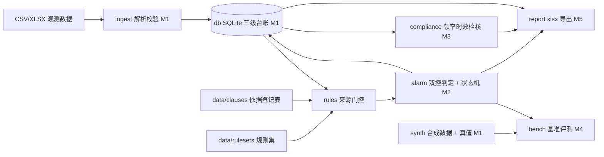

# pit-monitoring-checker

建筑基坑工程监测数据判读与预警工具：**全离线、规则优先、判定挂条款号、内置可复现基准**。
它管的是一座基坑从开挖到封底的全部量测读数 —— 台账持久、阈值来源可溯、"报警未处置"能一路跟着下一个轮次。

> **当前状态：M2 报警内核已完成**（契约级骨架 M0 + 合成时序与真值 M1 + 双控判定内核、状态机、未闭环跨轮次延续、XLSX 输入通路 M2）。
> 合规检核（M3）、基准评测（M4）、报告与界面（M5）尚未开工（见[路线图](#路线图)）。
> 现在可运行的部分是：契约自检、台账建库与建档、监测项目字典与规则集来源门控、合成数据生成与位级对账、
> 一轮观测数据的导入回执、台账修订链与缺测查询。

## 现在能做什么

| 命令 | 作用 | 状态 |
|---|---|---|
| `python -m pmc selfcheck` | 契约自检：依据登记表 / 监测项目字典 / 规则集来源门控 / 台账 DDL / 确定性 RNG | 可用 |
| `python -m pmc init --db ledger.sqlite` | 建 11 张表的空台账（工程→工况→测点→轮次→观测修订链→报警状态→处置→违规） | 可用 |
| `python -m pmc dict` | 列出监测项目字典与各自的来源登记状态 | 可用 |
| `python -m pmc rulesets` | 列出规则集版本、sha256 与启用门控统计（卡在哪个原因码） | 可用 |
| `python -m pmc synth --seed 20260107 --sites 3 --force [--db …]` | 生成三座虚拟基坑的合成时序与 7 类事件真值（字节冻结）；带 `--db` 时另建工程/工况/测点/轮次档案 | 可用 |
| `python -m pmc synth --check` | 与仓内 62 个产物逐字节对账，改生成器却忘重生成当场暴露 | 可用 |
| `python -m pmc import FILE --project SYN-ZHDQ --round 12 --db … [--dry-run]` | 导入一轮观测数据并出具导入回执（逐行拒收带原因码与物理行号） | 可用 |
| `python -m pmc ledger --db … --point SYN-TH-18` | 台账查询：修订链（谁取代谁）、缺测标记、加密观测轮次 | 可用 |
| `python -m pmc check --db ledger.sqlite --project SYN-ZHDQ [--round N] [--rules-dir DIR]` | 双控判定：有效阈值选取（档案值优先→条文回退→待定）、状态机、未闭环清单，结果落 `alarm_state` | 可用 |
| `pmc audit / bench / report / gui` | 频率时效检核 → 基准评测 → 报告导出 → 桌面界面 | 未开工，返回退出码 3 并指回里程碑 |

退出码语义（M0 定稿，之后不漂移）：`0` 完成 / `1` 完成但有降级（存在未闭环报警、未核对依据或被拒收行）/ `2` 输入不可用或契约校验失败 / `3` 命令所属里程碑未到。

## 指标

基准未跑之前，这里不允许出现漂亮数字。四态口径：**达标 / 未达标 / 不可判（分母为 0）/ 不可用（通路未通）**。

| 指标 | 状态 | 说明 | 复现命令 |
|---|---|---|---|
| 报警召回率 | 不可用 | 判定内核已落地（M2），但正式评测命令 `bench` 属 M4：逐起事件已在夹具档位下与真值对账通过，聚合比率尚未计算 —— 量不了，不是「达标」也不是「未达标」 | `python -m pmc bench` |
| 误报率 | 不可用 | 同上；分母侧已就绪：11369 行观测，其中 1568 行是零事件序列 | `python -m pmc bench` |
| 首超报警轮次定位误差 | 不可用 | 期望轮次已由生成器按合成档位**反算**（如 drift 植入第 8 轮、期望第 17 轮），等判定与评测落地 | `python -m pmc bench` |
| 漏报清单可导出 | 不可用 | 判定通路已落地（M2），导出与聚合属 M4 | `python -m pmc bench --json` |
| 未闭环跨轮次延续 | 达标 | 夹具档位下报警回落轮次仍带 `unclosed`，`first_alarm_round_id` 指向首个应报警轮次；py3.8 与 py3.12 各跑一轮回归 | `python -m pmc check --db … --project SYN-YYCG --rules-dir tests/fixtures/rulesets/fx_yycg` |
| 待定值阈值列脱空 | 达标 | 生产数据面 1568 行全待定值：`cum_threshold`/`rate_threshold` 为空 + 原因码，DTO 与 DDL CHECK 两处把守 | `python -m pmc check --db … --project SYN-LJ3` |
| 合成数据位级一致 | 达标 | 62 个产物与固定 seed 重生成逐字节一致；py3.8 与 py3.12 各跑一轮对账测试 | `python -m pmc synth --check` |
| 导入回执完备率 | 达标 | 实测批次 `rows_accepted + rows_rejected = rows_total` 全平衡；不平的批次被 DDL 的 CHECK 直接拒写 | `python -m pmc import …` |
| 契约自检 | 达标 | 依据登记 5 条 / 监测项目 14 项 / 规则 15 条，结构与来源门控自洽 | `python -m pmc selfcheck` |
| 可参与判定的规则条数 | 达标 | 实测 0 条：全部阈值未挂原文核对，按纪律输出"待定值"，不进报警判定 | `python -m pmc rulesets` |

## 纪律：未挂来源的阈值不进判定路径

这是本工具与普通 Excel 判读的真正差别，写在代码与表结构里，不是承诺：

- 阈值来源三选一登记（设计文件值 / 标准条文值 / 用户手填值），**无来源 = 待定值**，不得生效；
- 标准条文值必须 `status=verified` 且挂可直连原文渠道，`located`（知道条号在哪、数值没取到）与 `pending` 一样不得供货；
- 待定值结果记录的阈值数值字段一律为空 —— 不是 0、不是 NaN、不是"仅供参考"；SQLite 的 CHECK 约束会拒绝脏写；
- 规则集文件里**没有** `enabled` 字段：启用与否由门控单点决定，数据不得自称启用；
- 速率判据的窗口长度属项目配置，出现数值就必须挂 `window_source`；
- 上一轮"报警"未处置时，本轮即使数值回落也保持**未闭环**标记，跨轮次持久化；
- 重复上报**只追加不覆盖**：`revision_seq` 递增、前一条 `superseded_by` 指向新行，判定只取链上最新行，历史完整可查；
  同值重复不产生空修订，同一文件重放直接拒绝；
- 缺测就是缺测：`missing=1` 的行数值列为空，DDL 的 CHECK 拒绝"标了缺测却带值"，任何通路都不许插值补数；
- 演示数据的阈值标尺（合成自证档位）只活在生成器里：不写进 `data/` 任何文件，判定层 import 它会让测试变红；
- 数值字面只认 ASCII 十进制 —— Python 的 `\d` 认全角数字，`float("３.４")` 也照样给 3.4，放任就是替抄错的读数洗白；
- 报告里的每个数字都能回溯到台账行，签字栏空白不得声称"已审核"；
- 全离线：内核零第三方依赖，不导入 `socket/urllib/requests`，基准不联网、不调用任何大模型。

依据登记表见 [`data/clauses/register.json`](data/clauses/register.json)，查证纪律见 [`data/README.md`](data/README.md)。
标准条文数值一律留 `null` 待原文核对 —— 本项目不引用未经核对的数字。

## 快速开始

需要 Python 3.8+（3.8 与 3.12 均在 CI 覆盖）。

```bash
git clone https://github.com/<your-org>/pit-monitoring-checker.git
cd pit-monitoring-checker
py -m venv .venv           # Windows；Linux/macOS 用 python3 -m venv .venv
. .venv/bin/activate       # Windows 用 .venv\Scripts\activate
python -m pip install -U pip setuptools wheel
python -m pip install -e ".[dev]"

python -X utf8 -m pmc selfcheck            # 契约自检
python -X utf8 -m pmc init --db ledger.sqlite
python -X utf8 -m pmc rulesets             # 看有多少规则还在等核对

# M1：合成数据 → 建档 → 导入一轮 → 看修订链（仓内产物已冻结，这两步不重生成也能跑）
python -X utf8 -m pmc synth --check                                # 与仓内 62 个产物逐字节对账
python -X utf8 -m pmc synth --seed 20260107 --sites 3 --force --db ledger.sqlite
python -X utf8 -m pmc import data/raw/SYN-ZHDQ/round-12.csv --project SYN-ZHDQ --round 12 --db ledger.sqlite
#   IMPORT_RECEIPT … 总行 196 入库 195 拒收 1
#     REJECT row=128 reason=unit_mismatch SYN-TH-15 的单位应为 mm，实为 cm     ← 退出码 1（降级）
python -X utf8 -m pmc ledger --db ledger.sqlite --point SYN-TH-18 --from 9 --to 9

# M2：判定（不带夹具 = 全待定值；带 tests/fixtures 的夹具档位 = 出货通路走通）
python -X utf8 -m pmc check --db ledger.sqlite --project SYN-ZHDQ --round 11
#   CHECK_SUMMARY … undetermined=196 … 退出码 1（存在待定值 = 降级，不是失败）
#   第 12 轮只有 195 行：SYN-TH-15 那行单位错，导入时就被拒收，判定层看不到它
python -X utf8 -m pytest tests/test_alarm_regression.py   # 夹具档位挂上后：6 起事件逐一起命中真值
python -X utf8 -m pytest -rs
```

要重新生成全部演示数据：`python -X utf8 -m pmc synth --seed 20260107 --sites 3 --force` 后整目录提交，
`--check` 不过就别提交 —— 半套产物比没数据更糟。

## 路线图

| 里程碑 | 交付 | 状态 |
|---|---|---|
| M0 | plan 计划文档 + 契约级骨架（表结构 / 状态机契约 / 来源三态门控 / CLI 命令面 / 守门测试 / CI） | ✅ 2026-10-07 |
| M1 | 数据先行：合成时序生成器（带异常事件真值）+ 导入器与导入回执 + 修订链 | ✅ 已完成（XLSX 输入按 P07 推到 M2 初） |
| M2 | 双控报警判定引擎 + 状态机持久化（未闭环跨轮次延续） | ⬜ |
| M3 | 频率与时效合规检核 + 条款号逐条核对入库 | ⬜ |
| M4 | 内置基准评测：召回 / 误报 / 首超定位误差，一键复现 | ⬜ |
| M5 | xlsx 报告导出（标准库直写 OOXML）+ PySide6 界面 + onedir exe | ⬜ |
| M6 | 脱敏审计 + 干净环境验证 + 发布 GitHub | ⬜ |

里程碑出口判据与每周可演示物见 [`plan/05-里程碑与验收门.md`](plan/05-里程碑与验收门.md)。

## 架构



## 仓库结构

```
plan/            计划文档（00 索引、01 题目、02 架构、03 接口契约、04 数据计划、
                 05 里程碑与验收门、06 交付对标与决策记录、07–11 里程碑设计文档位、HANDOFF-*）
data/
  clauses/       依据登记表（每条标准的编号/名称/条款/查证状态/渠道）
  dict/          监测项目字典（不含阈值数值）
  rulesets/      双控报警与频率检核规则集（阈值一律 null，待原文核对）
  raw/ truth/ golden/   合成时序（M1 已生成 58 个轮次 CSV + manifest）/ 事件真值（3 份，11 起）/ 评测期望（M4）
src/pmc/
  contract/      状态枚举、阈值来源三态、跨模块数据流记录（最底层，被所有层依赖）
  db/            台账 DDL 与连接
  catalog/       监测项目字典装载
  rules/         规则集装载 + 启用门控
  ingest/ alarm/ compliance/ report/ synth/ bench/ gui/   各里程碑落地的层
  cli.py         命令面与退出码（单一事实源）
tests/           守门测试：EOL / 分层禁令 / 契约纪律 / DDL CHECK / 规则门控 / RNG 确定性 / CI / 打包
.github/workflows/ci.yml   ubuntu+windows × py3.8+3.12 四矩阵
```

## 边界与非目标

- **辅助判读，不是安全结论**：本工具判的是"该轮次该测点相对已挂来源的阈值是否超标"，**不判基坑是否安全**，不替代设计、施工、监理的处置决策；
- **不做验算**：不输出支护结构内力、稳定性安全系数类结论（属另一条产品线）；
- **不接设备、不做 BIM/大屏、不加 LLM 问答**；
- **数据红线**：全部本地存储、不联网、不上传；演示数据为程序生成的虚构工程，带 `SYNTHETIC` 标记。

## 版权与免责

MIT License。标准与规程的条文原文版权归原作者与发布机构所有：本仓库只登记编号、名称、条款号与查证状态，
不收录标准全文（`data/standards/` 已在 `.gitignore` 中排除）。

监测数据判读结果仅供工程管理人员参考，不构成结构安全结论，不能替代有资质的监测、设计与监理单位的判断。
