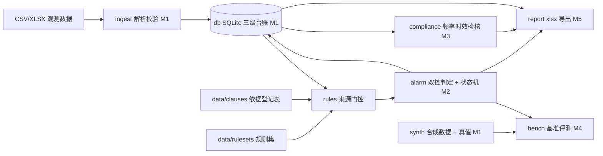

# pit-monitoring-checker

建筑基坑工程监测数据判读与预警工具：**全离线、规则优先、判定挂条款号、内置可复现基准**。
它管的是一座基坑从开挖到封底的全部量测读数 —— 台账持久、阈值来源可溯、"报警未处置"能一路跟着下一个轮次。

> **当前状态：M0 契约级骨架**。判定内核、导入器、报告导出与基准尚未开工（见[路线图](#路线图)）。
> 现在可运行的部分是：契约自检、空台账建库、监测项目字典与规则集的来源门控统计。

## 现在能做什么

| 命令 | 作用 | 状态 |
|---|---|---|
| `python -m pmc selfcheck` | 契约自检：依据登记表 / 监测项目字典 / 规则集来源门控 / 台账 DDL / 确定性 RNG | 可用 |
| `python -m pmc init --db ledger.sqlite` | 建 11 张表的空台账（工程→工况→测点→轮次→观测修订链→报警状态→处置→违规） | 可用 |
| `python -m pmc dict` | 列出监测项目字典与各自的来源登记状态 | 可用 |
| `python -m pmc rulesets` | 列出规则集版本、sha256 与启用门控统计（卡在哪个原因码） | 可用 |
| `pmc import / check / audit / bench / report / gui` | 导入 → 双控报警判定 → 频率时效检核 → 基准评测 → 报告导出 → 桌面界面 | 未开工，返回退出码 3 并指回里程碑 |

退出码语义（M0 定稿，之后不漂移）：`0` 完成 / `1` 完成但有降级（存在未闭环报警或未核对依据）/ `2` 输入不可用或契约校验失败 / `3` 命令所属里程碑未到。

## 指标

基准未跑之前，这里不允许出现漂亮数字。四态口径：**达标 / 未达标 / 不可判（分母为 0）/ 不可用（通路未通）**。

| 指标 | 状态 | 说明 | 复现命令 |
|---|---|---|---|
| 报警召回率 | 不可判 | 带真值的合成时序尚未生成（M1 数据、M4 评测） | `python -m pmc bench` |
| 误报率 | 不可判 | 同上 | `python -m pmc bench` |
| 首超报警轮次定位误差 | 不可判 | 同上；本题把它做成显式指标 | `python -m pmc bench` |
| 漏报清单可导出 | 不可用 | 判定通路未落地（M2） | `python -m pmc bench --json` |
| 契约自检 | 达标 | 依据登记 5 条 / 监测项目 14 项 / 规则 15 条，结构与来源门控自洽 | `python -m pmc selfcheck` |
| 可参与判定的规则条数 | 达标 | 实测 0 条：全部阈值未挂原文核对，按纪律输出"待定值"，不进报警判定 | `python -m pmc rulesets` |

## 纪律：未挂来源的阈值不进判定路径

这是本工具与普通 Excel 判读的真正差别，写在代码与表结构里，不是承诺：

- 阈值来源三选一登记（设计文件值 / 标准条文值 / 用户手填值），**无来源 = 待定值**，不得生效；
- 标准条文值必须 `status=verified` 且挂可直连原文渠道，`located`（知道条号在哪、数值没取到）与 `pending` 一样不得供货；
- 待定值结果记录的阈值数值字段一律为空 —— 不是 0、不是 NaN、不是"仅供参考"；SQLite 的 CHECK 约束会拒绝脏写；
- 规则集文件里**没有** `enabled` 字段：启用与否由门控单点决定，数据不得自称启用；
- 速率判据的窗口长度属项目配置，出现数值就必须挂 `window_source`；
- 上一轮"报警"未处置时，本轮即使数值回落也保持**未闭环**标记，跨轮次持久化；
- 报告里的每个数字都能回溯到台账行，签字栏空白不得声称"已审核"；
- 全离线：内核零第三方依赖，不导入 `socket/urllib/requests`，基准不联网、不调用任何大模型。

依据登记表见 [`data/clauses/register.json`](data/clauses/register.json)，查证纪律见 [`data/README.md`](data/README.md)。
标准条文数值一律留 `null` 待原文核对 —— 本项目不引用未经核对的数字。

## 快速开始

需要 Python 3.8+（3.8 与 3.12 均在 CI 覆盖）。

```bash
git clone https://github.com/<your-org>/pit-monitoring-checker.git
cd pit-monitoring-checker
py -m venv .venv           # Windows；Linux/macOS 用 python3 -m venv .venv
. .venv/bin/activate       # Windows 用 .venv\Scripts\activate
python -m pip install -U pip setuptools wheel
python -m pip install -e ".[dev]"

python -X utf8 -m pmc selfcheck            # 契约自检
python -X utf8 -m pmc init --db ledger.sqlite
python -X utf8 -m pmc rulesets             # 看有多少规则还在等核对
python -X utf8 -m pytest -rs
```

## 路线图

| 里程碑 | 交付 | 状态 |
|---|---|---|
| M0 | plan 计划文档 + 契约级骨架（表结构 / 状态机契约 / 来源三态门控 / CLI 命令面 / 守门测试 / CI） | ✅ 本轮 |
| M1 | 数据先行：合成时序生成器（带异常事件真值）+ 导入器与导入回执 + 修订链 | ⬜ |
| M2 | 双控报警判定引擎 + 状态机持久化（未闭环跨轮次延续） | ⬜ |
| M3 | 频率与时效合规检核 + 条款号逐条核对入库 | ⬜ |
| M4 | 内置基准评测：召回 / 误报 / 首超定位误差，一键复现 | ⬜ |
| M5 | xlsx 报告导出（标准库直写 OOXML）+ PySide6 界面 + onedir exe | ⬜ |
| M6 | 脱敏审计 + 干净环境验证 + 发布 GitHub | ⬜ |

里程碑出口判据与每周可演示物见 [`plan/05-里程碑与验收门.md`](plan/05-里程碑与验收门.md)。

## 架构



## 仓库结构

```
plan/            计划文档（00 索引、01 题目、02 架构、03 接口契约、04 数据计划、
                 05 里程碑与验收门、06 交付对标与决策记录、07–11 里程碑设计文档位、HANDOFF-*）
data/
  clauses/       依据登记表（每条标准的编号/名称/条款/查证状态/渠道）
  dict/          监测项目字典（不含阈值数值）
  rulesets/      双控报警与频率检核规则集（阈值一律 null，待原文核对）
  raw/ truth/ golden/   M1 起存放合成时序 / 异常事件真值 / 评测期望结果
src/pmc/
  contract/      状态枚举、阈值来源三态、跨模块数据流记录（最底层，被所有层依赖）
  db/            台账 DDL 与连接
  catalog/       监测项目字典装载
  rules/         规则集装载 + 启用门控
  ingest/ alarm/ compliance/ report/ synth/ bench/ gui/   各里程碑落地的层
  cli.py         命令面与退出码（单一事实源）
tests/           守门测试：EOL / 分层禁令 / 契约纪律 / DDL CHECK / 规则门控 / RNG 确定性 / CI / 打包
.github/workflows/ci.yml   ubuntu+windows × py3.8+3.12 四矩阵
```

## 边界与非目标

- **辅助判读，不是安全结论**：本工具判的是"该轮次该测点相对已挂来源的阈值是否超标"，**不判基坑是否安全**，不替代设计、施工、监理的处置决策；
- **不做验算**：不输出支护结构内力、稳定性安全系数类结论（属另一条产品线）；
- **不接设备、不做 BIM/大屏、不加 LLM 问答**；
- **数据红线**：全部本地存储、不联网、不上传；演示数据为程序生成的虚构工程，带 `SYNTHETIC` 标记。

## 版权与免责

MIT License。标准与规程的条文原文版权归原作者与发布机构所有：本仓库只登记编号、名称、条款号与查证状态，
不收录标准全文（`data/standards/` 已在 `.gitignore` 中排除）。

监测数据判读结果仅供工程管理人员参考，不构成结构安全结论，不能替代有资质的监测、设计与监理单位的判断。
